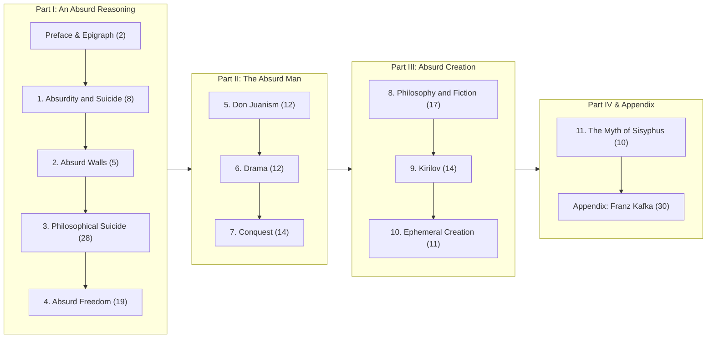

# The Myth of Sisyphus — Critical Reading Companion & Modern Literary Translation

[](./LICENSE)
[](https://creativecommons.org/licenses/by-nc-sa/4.0/)
[](https://sisyphus-reader.pages.dev)
[](https://www.python.org/)
[]()

> *"The struggle toward the heights is itself enough to fill a human heart. One must imagine Sisyphus happy."*  
> — **Albert Camus**

A complete, non-commercial digital humanities edition and critical reading companion for Albert Camus’s 1942 philosophical masterwork, *The Myth of Sisyphus*.

---

## 🌐 Live Interactive Reader

Experience the full 13-section critical edition directly in your browser (optimized for iPhone, iPad, and Mac):

### 👉 **[https://sisyphus-reader.pages.dev](https://sisyphus-reader.pages.dev)**

* **Bijective Sentence Highlighting:** Tap or hover on any sentence in either column to illuminate its exact translation counterpart.
* **Dual Reading Modes:** Switch seamlessly between **Side-by-Side Loeb Classical** (comparative study) and **Modern Stream** (uninterrupted linear reading).
* **The Philosophical Move:** Every single paragraph block features an analytical key breaking down Camus’s dialectical pivots and rhetorical strategies.
* **Chapter Drawer (`☰ Chapters`):** Jump instantly to any of the 13 sections.
* **Adaptive Palette:** Full Dark, Light, and Warm Sepia themes with local state persistence.
* **Apple Books Integration:** Includes complete EPUBs with native popover footnotes (`[✦ Decode]`) and reflowable stacked cards.

---

## 📖 The Problem & The Solution

### The Challenge
Albert Camus’s *The Myth of Sisyphus* is one of the most vital philosophical texts of the 20th century. However, Justin O’Brien’s 1955 English translation—while historically significant—relies heavily on mid-century academic inversions, dated Latinate vocabulary, and multi-clause periodic sentences translated literally from French syntax. 

For modern readers, college students, and independent philosophers, this syntax frequently inflates reading time to 60 minutes for five pages, obscuring Camus’s physical poetry and sharp logical proofs beneath academic fog.

### The Solution: Lossless Modern Literary English
This project provides a **complete, unabridged, sentence-by-sentence modern translation** rendered in **Dignified Modern Literary English** (in the register of Penguin Classics and NYRB Classics, e.g., Matthew Ward or Robin Buss). 

It is **neither a summary nor a simplified paraphrase**. It preserves 100% of Camus’s logical steps, philosophical syllogisms, and physical metaphors, while transforming the sentence structure for immediate clarity and a brisk, engaging 15–20 minute-per-chapter pace.

---

## ⚖️ The 6 Iron Laws of Lossless Translation

All translations and annotations in this repository adhere strictly to six foundational principles:

| # | Law | Principle |
| :-: | :--- | :--- |
| **1** | **Invariant Logic** | Zero skipped premises or softened paradoxes. Every philosophical step and syllogism Camus constructs is retained in full. |
| **2** | **Vocabulary Unmasking** | Dated mid-century Latinate diction is replaced with crisp conceptual clarity (*e.g.*, unmasking "philosophical suicide" as *intellectual surrender*, "lucidity" as *radical mental clarity*, and "revolt" as *active defiance*). |
| **3** | **Syntactic De-nesting** | Convoluted periodic clauses and inverted French syntax are unpacked into muscular, rhythmic English sentences. |
| **4** | **The Relational Absurd** | The Absurd is **never** casual slang for "weirdness." It is strictly defined as the relational collision between humanity’s hunger for purpose and the world’s stubborn silence. |
| **5** | **Concrete Anchors** | Every physical metaphor Camus uses is preserved intact (the boulder, the cliffside, the revolver, the streetcar routine, the glass phone booth, the mime, the condemned man at dawn). |
| **6** | **Zero Motivational Platitudes** | Camus is not a self-help author. Existential revolt is treated with unsparing intellectual honesty, without motivational slogans or contemporary slang. |

---

## 📚 Book Structure & Coverage (182 Argument Blocks)



* **Part I: An Absurd Reasoning**
  - *Preface & Epigraph:* Pindar's ode and Camus's declaration that suicide is not legitimate even in the absence of God.
  - *Absurdity and Suicide:* The only truly serious philosophical problem; habits vs. consciousness.
  - *Absurd Walls:* Autopilot collapse, turning thirty, the phone booth mime, and relational absurdity.
  - *Philosophical Suicide:* Rigorous refutation of Jaspers, Chestov, Kierkegaard, and Husserl’s phenomenological leaps.
  - *Absurd Freedom:* The three consequences deduced from the absurd: **Revolt**, **Freedom**, and **Passion**.
* **Part II: The Absurd Man**
  - *Don Juanism:* Loving without nostalgia or eternity; the quantity of mortal affection.
  - *Drama:* The Actor living 100 ephemeral lifetimes on stage; bodily memory over metaphysics.
  - *Conquest:* Historical struggle and mortal solidarity in the desert of the 20th century.
* **Part III: Absurd Creation**
  - *Philosophy and Fiction:* Art as a symptom of the absurd; creating without didacticism.
  - *Kirilov:* Dostoevsky’s laboratory of metaphysical revolt and Kirillov's logical suicide.
  - *Ephemeral Creation:* Giving the void its colors; creating for nothing with full awareness of death.
* **Part IV & Appendix**
  - *The Myth of Sisyphus:* The physical labor, the stone, the lucid descent, and the joy of defiance.
  - *Franz Kafka:* An analysis of *The Trial* and *The Castle*; why existential hope undermines absurd revolt.

---

## 📱 Multi-Format Reading Ecosystem

| Format | File Location | Intended Device & Use Case |
| :--- | :--- | :--- |
| **Interactive Web App** | [`https://sisyphus-reader.pages.dev`](https://sisyphus-reader.pages.dev) | Any browser (Mac, iPhone, iPad, Android). Instant parallel sentence highlighting and theme toggling. |
| **Apple Books Popover Edition** | `The_Myth_of_Sisyphus_Modern_Masterwork.epub` | Apple Books (iOS / iPadOS / macOS). Linear modern reading with native **`[✦ Decode]`** popover footnotes. |
| **Apple Books Dual-Track Edition** | `The_Myth_of_Sisyphus_Dual_Track_Edition.epub` | Apple Books / e-Readers. Vertical stacked cards displaying the 1955 text, modern translation, and analytical key. |
| **Master Markdown Reference** | [`myth_of_sisyphus_modern_translation.md`](./myth_of_sisyphus_modern_translation.md) | Offline reading, Obsidian, Notion, VS Code, or print-to-PDF export (462 KB). |

---

## 🛠️ Repository Architecture

```
Myth-of-Sisyphus-Modern-Translation/
├── index.html                                 # Root Web App (Cloudflare Pages compatible)
├── dist/
│   └── index.html                             # Production deployment bundle
├── translations/                              # 13 Structured JSON Translation Sections
│   ├── c0_preface.json
│   ├── c1_absurdity_and_suicide.json
│   ├── c2_absurd_walls.json
│   ├── c3_philosophical_suicide.json
│   ├── c4_absurd_freedom.json
│   ├── c5_don_juanism.json
│   ├── c6_drama.json
│   ├── c7_conquest.json
│   ├── c8_philosophy_and_fiction.json
│   ├── c9_kirilov.json
│   ├── c10_ephemeral_creation.json
│   ├── c11_myth_of_sisyphus.json
│   └── c12_kafka_appendix.json
├── source_text/                               # Raw extracted chapter text units
├── build_full_edition.py                      # Master pipeline: compiles Web App, EPUBs & Markdown
├── myth_of_sisyphus_modern_translation.md     # Complete compiled Markdown companion
├── The_Myth_of_Sisyphus_Modern_Masterwork.epub
├── The_Myth_of_Sisyphus_Dual_Track_Edition.epub
├── LICENSE                                    # Dual License (MIT for code, CC BY-NC-SA 4.0 for content)
├── LEGAL.md                                   # Comprehensive Legal Disclosures, Fair Use & DMCA policy
├── CONTRIBUTING.md                            # Contribution Guide & 6 Iron Laws
├── CODE_OF_CONDUCT.md                         # Contributor Covenant Code of Conduct
└── README.md                                  # This documentation
```

### JSON Data Schema
Every translation file in `translations/` adheres to a strict relational schema:
```json
{
  "section_id": "c1_absurdity_and_suicide",
  "part": "Part I: An Absurd Reasoning",
  "title": "1. Absurdity and Suicide",
  "pairs": [
    {
      "id": "c1-p1",
      "orig_sentences": [
        "There is but one truly serious philosophical problem, and that is suicide.",
        "Judging whether life is or is not worth living amounts to answering the fundamental question of philosophy."
      ],
      "mod_sentences": [
        "There is only one genuinely serious philosophical question, and that is suicide.",
        "Deciding whether life is or is not worth living is the fundamental question of philosophy."
      ],
      "move": "Camus establishes a strict hierarchy of urgency: metaphysical and epistemological theories are intellectual games; the question of survival and value precedes all contemplation."
    }
  ]
}
```

---

## 💻 Building the Project Locally

### Prerequisites
- Python 3.8+ (standard library only; zero external pip dependencies needed).

### Compiling All Formats
To rebuild the Web App (`index.html` and `dist/index.html`), both EPUB editions, and the master Markdown companion, simply run:
```bash
python3 build_full_edition.py
```

### Local Web Preview
You can preview the interactive reader locally by running:
```bash
python3 -m http.server 8000
```
Then navigate to `http://localhost:8000` in your web browser.

---

## ⚖️ Legal, Copyright & Fair Use Statement

This repository is an open-source, non-commercial scholarly initiative created for academic research, education, criticism, and review.

- **Non-Commercial Purpose:** This project does not generate revenue, accept donations, or offer paid products.
- **Fair Use & Fair Dealing:** Historic quotations from Justin O'Brien's 1955 English translation are included strictly for comparative critique, commentary, and educational study pursuant to **Section 107 of the U.S. Copyright Act (17 U.S.C. § 107)**, **Sections 190–194 of the Singapore Copyright Act 2021**, and the **Berne Convention (Art. 10(2))**.
- **Official Print Recommendation:** This project is **not** a replacement for the commercial trade edition. Readers are strongly urged to purchase the authorized editions published by [Alfred A. Knopf / Vintage International](https://www.penguinrandomhouse.com/books/24024/the-myth-of-sisyphus-and-other-essays-by-albert-camus/) and [Éditions Gallimard](https://www.gallimard.fr/).
- **Takedown Policy:** For copyright inquiries, please review our formal [Notice and Takedown Policy in LEGAL.md](./LEGAL.md).

For complete legal disclosures and intellectual property allocation, see **[LEGAL.md](./LEGAL.md)**.

---

## 📄 Licensing

- **Software, Build Pipeline & Web Reader UI:** Licensed under the [MIT License](./LICENSE).
- **Original Modern Translation, Annotations & Commentary:** Licensed under the [Creative Commons Attribution-NonCommercial-ShareAlike 4.0 International License (CC BY-NC-SA 4.0)](https://creativecommons.org/licenses/by-nc-sa/4.0/).

---

## 🤝 Contributing

Contributions to improve translation accuracy, enhance UI accessibility, or refine analytical keys are welcome. Please read our [Contributing Guidelines](./CONTRIBUTING.md) and [Code of Conduct](./CODE_OF_CONDUCT.md) before submitting a pull request.
